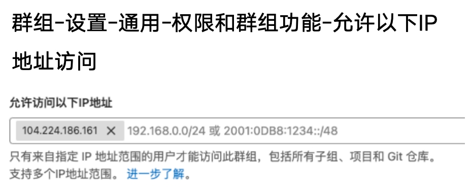

# gitlab_tutorial

记录租用gitlab企业版使用指南。<br>
- [gitlab\_tutorial](#gitlab_tutorial)
  - [为团队成员创建账号并分配权限:](#为团队成员创建账号并分配权限)
    - [设置权限:](#设置权限)
    - [2FA双因素认证(可选):](#2fa双因素认证可选)
    - [IP访问限制(可选):](#ip访问限制可选)
  - [项目隔离:](#项目隔离)
  - [定义受保护分支:](#定义受保护分支)
  - [分支命名规范:](#分支命名规范)
    - [分支命名示例:](#分支命名示例)
    - [注意点:](#注意点)
  - [定义推送规则:](#定义推送规则)
  - [分支开发工作流:](#分支开发工作流)
  - [代码质量:](#代码质量)
    - [注释:](#注释)
    - [单元测试:](#单元测试)

## 为团队成员创建账号并分配权限:

### 设置权限:


极狐GitLab SaaS 无需用户安装，注册即可开启云端使用。极狐作为服务的提供方，负责SaaS服务的高可用架构、灾备恢复等维护；用户为服务等消费者，**最高权限为群组所有者(Group Owner)**。<br>


### 2FA双因素认证(可选):

密码+扫码，防止密码泄漏后被恶意登录。<br>


### IP访问限制(可选):

限制只有公司内网IP地址或指定IP白名单，防止员工在其他地点访问GitLab。<br>




## 项目隔离:

小程序(网页)部分、AI算法不同部门代码分离。不同项目组的人看不到其他项目组的代码。<br>


## 定义受保护分支:

定义受保护分支，防止代码越权提交。<br>


## 分支命名规范:

以下规定的是企业内部分支命名规范，注意定义的来源(姓名)和创建时间。非企业内部分支可以去除来源(姓名)和创建时间。<br>

1. **主分支**:
   - `main` 或 `master`: 主要分支，通常是项目的生产版本分支。

2. **开发分支**:
   - `develop`: 开发主分支，通常是集成所有开发工作的分支。

3. **功能分支** (Feature branches):
   - `feature/<功能描述>`: 用于开发新功能。示例：`feature/peilongchencc/20240628/user-authentication`

4. **修复分支** (Bugfix branches):
   - `bugfix/<修复描述>`: 用于修复项目中的bug。示例：`bugfix/peilongchencc/20240613/fix-login-issue`

5. **发布分支** (Release branches):
   - `release/<版本号>`: 用于准备发布的分支。示例：`release/peilongchencc/20240611/1.0.0`

6. **热修复分支** (Hotfix branches):
   - `hotfix/<修复描述>`: 用于修复生产环境中的紧急问题。示例：`hotfix/peilongchencc/20240601/fix-critical-bug`

### 分支命名示例:

以下是一个示例结构，展示了如何根据不同的需求创建和命名分支：<br>

```log
main
develop
feature/peilongchencc/20240628/user-authentication
feature/peilongchencc/20240625/add-payment-gateway
bugfix/peilongchencc/20240613/fix-login-issue
bugfix/peilongchencc/20240611/fix-signup-validation
release/peilongchencc/20240611/1.0.0
release/peilongchencc/20240621/1.1.0
hotfix/peilongchencc/20240601/fix-critical-bug
```

### 注意点:

1. **保持一致性**: 确保团队中的所有成员遵循相同的命名规范，以便于分支的管理和查找。
2. **描述清晰**: 分支名应当清晰地描述分支的内容或目的，避免使用过于简短或模糊的名字。
3. **使用连字符**: 使用连字符（`-`）来分隔单词，使分支名更加易读。


## 定义推送规则:


`git commit` 的消息需简介、明了，禁止仅使用 "提交"、"修改" 等无意义消息。<br>


## 分支开发工作流:


合并分支时:

1. 审批人需要先确定提交分支与主分支是否有冲突，如果有冲突，需要让提交人解决。

2. 代码审批，杜绝提交垃圾文件，冗余代码，无用代码，垃圾代码。防止主程序逻辑混乱，无关程序影响主程序耗时。


## 代码质量:


尤其是项目解释型文档(`README.md`)、代码注释，如果不合格，审批不予以通过。<br>

### 注释:

代码注释风格可参考**google风格注释**，python代码的示例如下:<br>

```python
async def qa_rag_service(question):
    """qa问答对检索。
    Args:
        question(str): 用户输入。
    Returns:
        milvus_rtn(dict): 用户输入在milvus中匹配的top结果。
    """

    # 自己的代码

    return milvus_rtn
```

🚨 python 代码缩进统一使用4个空格。<br>

### 单元测试:

添加重要功能时，必须经过单元测试保证函数或功能完整实现。<br>

可以参考下列单元测试示例，也可以自定义测试方法，关键是保证添加的功能正常实现，不影响主程序运行。<br>

假设你有一个简单的函数 `add`，用于将两个数相加：<br>

```python
"""
Description: 实现add函数。
Notes: 
"""
# mymodule.py

def add(a, b):
    return a + b
```

可以在根目录下`tests`目录为这个函数编写一个单元测试：<br>

```python
"""
Description: 定义单元测试，测试add函数效果。
Notes: 
"""
# test_mymodule.py

import sys
import os

# 获取当前脚本的绝对路径
current_script_path = os.path.abspath(__file__)
# 获取当前脚本的父目录的父目录
parent_directory_of_the_parent_directory = os.path.dirname(os.path.dirname(current_script_path))
# 将这个目录添加到 sys.path
sys.path.append(parent_directory_of_the_parent_directory)

import unittest
from mymodule import add

class TestAddFunction(unittest.TestCase):
    def test_add(self):
        self.assertEqual(add(1, 2), 3)
        self.assertEqual(add(-1, 1), 0)
        self.assertEqual(add(0, 0), 0)

if __name__ == "__main__":
    unittest.main()
```

在这个例子中，`TestAddFunction` 是一个测试类，它继承自 `unittest.TestCase` 。`test_add` 方法是一个测试方法，用于验证 `add` 函数的输出是否符合预期。`self.assertEqual` 方法用于检查两个值是否相等。如果不相等，则测试失败。<br>

运行这个测试文件时，会自动执行所有测试方法，并报告测试结果：<br>

```bash
python test_mymodule.py
```

如果你的单元测试运行成功，没有发现任何问题。终端将输出类似以下内容：<br>

```markdown
.
----------------------------------------------------------------------
Ran 1 test in 0.000s

OK
```

1. `.`：表示一个测试用例成功通过。每个成功通过的测试用例在输出中都会显示一个点。
2. `Ran 1 test in 0.000s`：表示运行了一个测试用例，并且测试运行时间非常短（0.000秒）。
3. `OK`：表示所有测试用例都通过了，没有任何失败或错误。

这意味着你的`add`函数在测试用例中表现正确，返回了预期的结果。<br>


